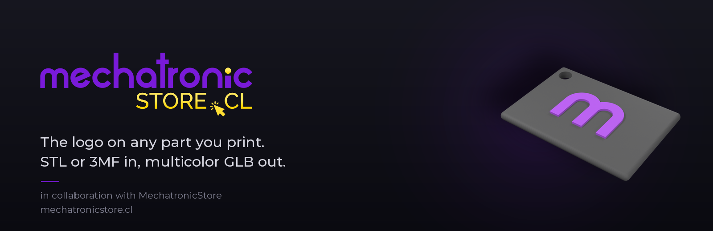
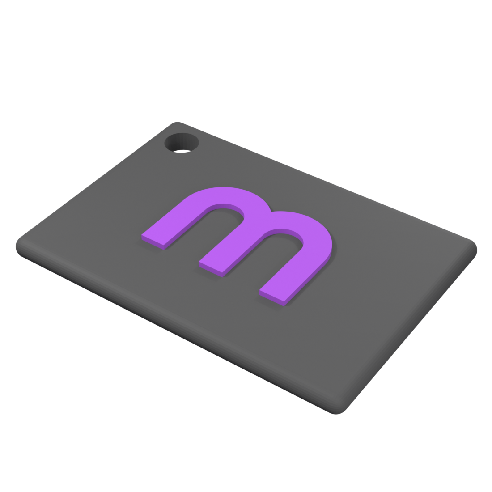
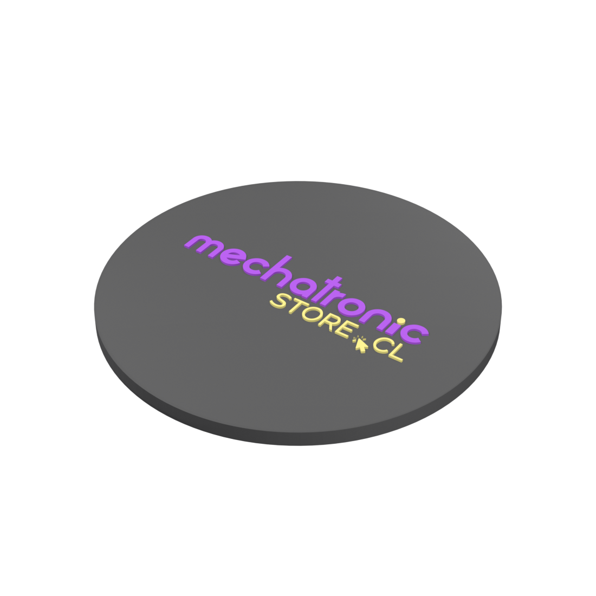

<div align="center">



<br>

[](https://github.com/MechatronicStore/mechatronicstore-logo-3d/actions/workflows/tests.yml)
[](LICENSE)
[](https://www.python.org/downloads/)
[](https://www.blender.org/download/)
[](#what-goes-in)

**Drop in an `.stl` or a MakerWorld `.3mf`, get back a multicolor `.glb` for Bambu Studio.**

[Install](INSTALL.md) · [Quick start](#quick-start) · [Options](#options-that-matter) · [How it works](#how-it-works) · [Español](#español)

</div>

---

## What it does

One mesh per logo color, so the AMS prints crisp letters instead of a blurry
patch. Point it at a part, pick the logo, look at the previews, print.

<div align="center">

| `--logo m` | `--logo full` |
|:---:|:---:|
|  |  |
| Just the **m**. Keychains, lids, small faces | The full wordmark. Flat, wide surfaces |
| `--logo m --logo-size-mm 22` | `--logo full --logo-size-mm 70` |

Both images are straight output of the tool, rendered with `tools/render_showcase.py`.

</div>

## Quick start

New here? The [step by step install guide](INSTALL.md) covers macOS, Windows and
Linux, and takes about 15 minutes. The short version:

```bash
git clone https://github.com/MechatronicStore/mechatronicstore-logo-3d.git
cd mechatronicstore-logo-3d
uv sync
```

You also need **Blender 4.x or 5.x**. It is found automatically on PATH and at
the macOS default location; otherwise set `BLENDER_PATH`.

Then:

```bash
# an .stl, with the m, and previews to check the result
python logo3d.py --model examples/coaster_simple.stl --logo m --preview

# a .3mf from MakerWorld: see what is inside first
python logo3d.py --model "Dragon Egg Container.3mf" --list-pieces
#   1. Dragon Egg Empty.stl_A  (105 x 105 x 79 mm, 447,954 tris)
#   2. Dragon Egg Empty.stl_B  (93 x 93 x 60 mm, 259,454 tris)

# then pick the piece you want the logo on
python logo3d.py --model "Dragon Egg Container.3mf" --piece 2 \
                 --logo full --logo-size-mm 40 --preview
```

The result lands next to the input as `<name>_logo.glb`, plus a
`<name>_logo_previews/` folder when you pass `--preview`. Your original file is
never modified.

### What goes in

| Format | Support |
|---|---|
| `.stl` | Binary and ASCII, used as is |
| `.3mf` | Full read: production extension, nested components, unit conversion, build transforms. MakerWorld, Printables and Bambu Studio exports all work |
| `.svg` | Any logo with filled paths in solid colors. The two brand logos ship in `assets/` |

### Opening the result in Bambu Studio

This is the step everyone gets wrong:

1. Launch Bambu Studio **first**, with no file open.
2. **Drag** the `.glb` onto the build plate. Double-clicking the file does not work.
3. Assign a filament to each color and slice.

In `--mode texture` Bambu asks *"Convert texture to color painting?"*. Say yes.
If that prompt never appears, you double-clicked instead of dragging.

## Options that matter

| Flag | What it does |
|---|---|
| `--logo m \| full \| your.svg` | Bundled logo, or any SVG of your own |
| `--logo-size-mm 30` | Logo width. Default: 45% of the part's shortest top edge |
| `--logo-height-mm 0.6` | How far it sticks out. 0.4 to 0.8 prints cleanly |
| `--engrave` | Sink the logo into the surface instead of raising it |
| `--offset-x-mm`, `--offset-y-mm` | Move the logo off the center of the top face |
| `--piece N`, `--merge-pieces` | Which piece of a multi part `.3mf` to use |
| `--preview` | Render 4 views as PNGs. **Look at them before printing** |
| `--also-3mf`, `--also-stls` | Extra outputs for slicers without GLB support |
| `--circuits` | Procedural PCB trace decoration around the logo |
| `--mode texture` | Keep the geometry untouched, paint a UV texture instead |

Full list: `python logo3d.py --help`.

## How it works

```
.3mf ──► mesh_input.py ──► .stl ──┐
                                  ├──► apply_logo_geom.py ──► .glb  (one mesh per color)
.svg ──────────── logo ───────────┘      (Blender, headless)
```

* **`mesh_input.py`** flattens a `.3mf`, which is really a zip full of XML, into
  triangles. Only geometry is read: paint data, slicing settings and thumbnails
  are ignored, never copied into the output.
* **`apply_logo_geom.py`** imports the SVG as curves, groups the paths by fill
  color, extrudes each group and centers the result on the top face.
* Every run **raycasts under the logo** and warns you when it would print in mid
  air. Parts from model sites are often hollow or frame shaped, and the center of
  the bounding box lands over a hole more often than you would think:

  ```
  [geom] WARNING support check: only 0% of the logo sits on the top surface.
  [geom]   100% of it hangs over open air. This part is hollow, frame shaped,
  [geom]   or the logo runs past the edge.
  [geom]   Move it with --offset-x-mm / --offset-y-mm, or shrink --logo-size-mm.
  ```

### Known limits

* The logo goes on the **top face** of the part as oriented in the file. Rotate
  the model first if you want a different face.
* Curved surfaces get a flat projection. Fine on a gentle dome, wrong on a cylinder.
* `--mode texture` colors per triangle, so small logos look blocky. Use the
  default `geom` mode unless you cannot touch the geometry.

## Repository layout

```
logo3d.py              the CLI, the only file you run
mesh_input.py          .3mf and .stl reader
apply_logo_geom.py     Blender: SVG colors to extruded meshes  (default mode)
apply_logo.py          Blender: UV texture mode
render_previews.py     4 flat views to verify a result
export_3mf.py          .3mf writer for --also-3mf
assets/                logo-m.svg, logo-full.svg
examples/              a coaster and a keychain to try things on
tools/                 showcase renders and the README banner
tests/                 90 tests, no Blender needed
```

## Tests

```bash
uv run pytest -q
```

90 tests and none of them need Blender: the `.3mf` fixtures are built inside the
tests, so there are no binary blobs in the repository.

## License

Code: [MIT](LICENSE). The MechatronicStore logo files in `assets/` are a
trademark with their own terms: see [TRADEMARK.md](TRADEMARK.md).

Short version: printing, giving away, posting and teaching with branded parts is
free and needs no permission. Selling them needs one email to
ventas@mechatronicstore.cl, and the usual answer is yes.

Using your own logo instead works exactly the same: `--logo my-logo.svg`.

---

# Español

Le pone el logo de MechatronicStore a cualquier `.stl` o `.3mf`, incluidos los
que bajas de MakerWorld tal cual, y te devuelve un `.glb` multicolor listo para
el AMS: una malla por color, un filamento por malla, letras nítidas.

**Instalación:** la [guía paso a paso](INSTALL.md) cubre macOS, Windows y Linux
sin dar por sabido nada. Resumen: Blender, Python 3.12 o superior, `uv sync`.

```bash
# la m sola sobre un STL, con previews para revisar antes de imprimir
python logo3d.py --model examples/coaster_simple.stl --logo m --preview

# un 3mf de MakerWorld: primero mira qué piezas trae
python logo3d.py --model "Tu Modelo.3mf" --list-pieces

# después elige la pieza y el logo completo
python logo3d.py --model "Tu Modelo.3mf" --piece 2 --logo full --preview
```

**Para abrirlo en Bambu Studio:** abre Bambu Studio primero, sin ningún archivo,
y **arrastra** el `.glb` a la placa. Con doble clic no funciona.

**Los dos logos incluidos:** `--logo m` (la m sola, para piezas chicas) y
`--logo full` (el logotipo completo, para superficies planas y anchas). También
puedes pasar tu propio SVG con `--logo mi-logo.svg`.

**Tamaños que funcionan bien:** 22 mm de ancho para un llavero, 40 mm para una
tapa, 70 mm para un posavasos. Si no indicas `--logo-size-mm`, usa el 45% del
lado más corto de la cara de arriba.

El logo va siempre en la **cara superior** según la orientación del archivo, y
cada corrida revisa con rayos si hay material debajo: si la pieza es hueca o tipo
marco, te avisa que quedaría al aire y te dice cómo moverlo. Tu archivo original
nunca se modifica.

Código MIT. El logo es marca registrada con sus propios términos en
[TRADEMARK.md](TRADEMARK.md): imprimir, regalar, publicar fotos y hacer clases
con piezas de marca es libre y no requiere permiso. Venderlas necesita un correo
a ventas@mechatronicstore.cl, y la respuesta normalmente es sí.

<div align="center">
<br>
<sub>Hecho en colaboración con <b>MechatronicStore</b> · <a href="https://mechatronicstore.cl">mechatronicstore.cl</a></sub>
</div>
