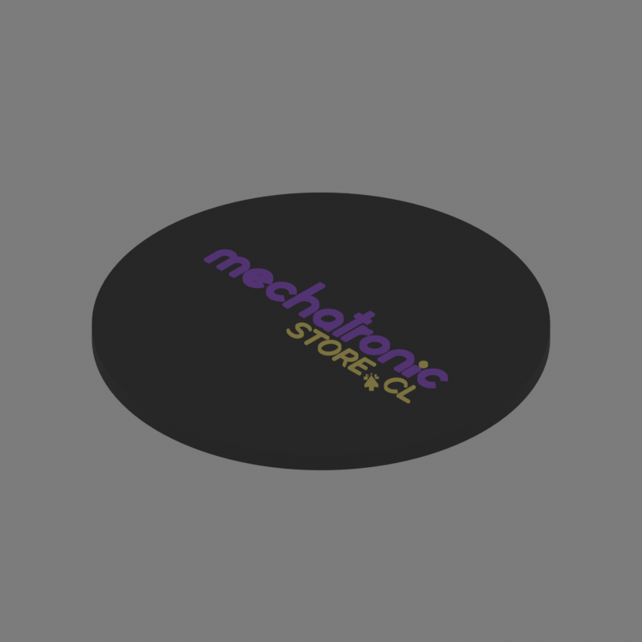

# logo3d — the MechatronicStore logo on any printable part

Put the MechatronicStore logo on any `.stl` or `.3mf` and get back a multicolor
`.glb` you can slice on a Bambu printer with the AMS: one mesh per logo color,
one filament per mesh, sharp letters.

Two logos ship with the repo:

| `--logo m` | `--logo full` |
|---|---|
| just the **m** — keychains, lids, small faces | the full wordmark — flat, wide surfaces |
|  |  |

Those two images are actual output of the tool: `--logo m --engrave` on a
keychain, and `--logo full` on a coaster.

*(Español más abajo.)*

---

## Install

```bash
git clone https://github.com/PabloSilvaBravo/mechatronicstore-logo-3d.git
cd mechatronicstore-logo-3d
uv sync                      # or: pip install -r <(uv export --no-hashes)
```

You also need **Blender 4.x or 5.x** — the pipeline drives it headless. It is
found automatically on PATH or at the macOS default location; otherwise point
`BLENDER_PATH` at the executable:

```bash
export BLENDER_PATH="/Applications/Blender.app/Contents/MacOS/Blender"
```

## Use it

```bash
# an .stl, with the m, and previews to check the result
python logo3d.py --model examples/coaster_simple.stl --logo m --preview

# a .3mf downloaded from MakerWorld: see what is inside first
python logo3d.py --model "Dragon Egg Container.3mf" --list-pieces
#   1. Dragon Egg Empty.stl_A  (105 x 105 x 79 mm, 447,954 tris)
#   2. Dragon Egg Empty.stl_B  (93 x 93 x 60 mm, 259,454 tris)

# then pick the piece you want the logo on
python logo3d.py --model "Dragon Egg Container.3mf" --piece 2 \
                 --logo full --logo-size-mm 40 --preview
```

The output lands next to the input as `<name>_logo.glb`, plus a
`<name>_logo_previews/` folder when you pass `--preview`.

### Opening the result in Bambu Studio

This part trips everyone up:

1. Launch Bambu Studio **first**, with no file open.
2. **Drag** the `.glb` onto the build plate. Double-clicking the file does not work.
3. Assign a filament to each color and slice.

In `--mode texture` Bambu asks *"Convert texture to color painting?"* — say yes.
If you never see that prompt, you double-clicked instead of dragging.

## Options that matter

| Flag | What it does |
|---|---|
| `--logo m \| full \| your.svg` | Bundled logo, or any SVG of your own |
| `--logo-size-mm 30` | Logo width. Default: 45% of the part's shortest top edge |
| `--logo-height-mm 0.6` | How far it sticks out. 0.4–0.8 prints cleanly |
| `--engrave` | Sink the logo into the surface instead of raising it |
| `--offset-x-mm / --offset-y-mm` | Move the logo off the center of the top face |
| `--piece N` / `--merge-pieces` | Which piece of a multi-part `.3mf` to use |
| `--preview` | Render 4 views as PNGs. **Look at them before printing** |
| `--also-3mf` / `--also-stls` | Extra outputs for slicers without GLB support |
| `--circuits` | Procedural PCB-trace decoration around the logo |
| `--mode texture` | Keep the geometry untouched, paint a UV texture instead |

Run `python logo3d.py --help` for the full list.

## How it works

```
.3mf ──► mesh_input.py ──► .stl ──┐
                                  ├──► apply_logo_geom.py (Blender headless) ──► .glb
.svg ──────────────────── logo ───┘        one extruded mesh per SVG color
```

* `mesh_input.py` flattens a `.3mf` (a zip of XML) into triangles: production
  extension, nested components, unit conversion and build transforms included.
  Only geometry is read — paint data, slicing settings and thumbnails are ignored.
* `apply_logo_geom.py` imports the SVG as curves, groups the paths by fill color,
  extrudes each group, and centers the result on the top face of the part.
* Every run raycasts under the logo and **warns you when it would print in
  mid-air** — hollow and frame-shaped parts from model sites are common, and the
  center of the bounding box is often over a hole.

### Known limits

* The logo always goes on the **top face** of the part as it is oriented in the
  file. Rotate the model in your slicer or CAD first if you want another face.
* Curved surfaces get a flat projection. Fine for a gentle dome, wrong for a cylinder.
* `--mode texture` colors per triangle, so small logos look blocky. Use the
  default `geom` mode unless you must not touch the geometry.

## Tests

```bash
uv run pytest -q
```

90 tests, none of which need Blender: the `.3mf` fixtures are built inside the
tests, so there are no binary blobs in the repo.

## License

Code: [MIT](LICENSE). The MechatronicStore logo files under `assets/` are a
trademark and have their own terms — see [TRADEMARK.md](TRADEMARK.md). Short
version: print all the MechatronicStore-branded parts you like, don't pass
yourself off as the company.

---

# Español

Le pone el logo de MechatronicStore a cualquier `.stl` o `.3mf` (los que bajas de
MakerWorld sirven tal cual) y te devuelve un `.glb` multicolor listo para el AMS:
una malla por color, un filamento por malla, letras nítidas.

```bash
# la m sola sobre un STL, con previews para revisar antes de imprimir
python logo3d.py --model examples/coaster_simple.stl --logo m --preview

# un 3mf de MakerWorld: primero mira qué piezas trae
python logo3d.py --model "Dragon Egg Container.3mf" --list-pieces

# después elige la pieza y el logo completo
python logo3d.py --model "Dragon Egg Container.3mf" --piece 2 --logo full --preview
```

Necesitas Blender 4.x o 5.x instalado (se busca solo en PATH, o defines
`BLENDER_PATH`). El resultado queda junto al archivo de entrada.

**Para abrirlo en Bambu Studio:** abre Bambu Studio primero y **arrastra** el
`.glb` a la placa. Si haces doble clic al archivo, no funciona.

Dos logos vienen incluidos: `--logo m` (la m sola, para piezas chicas) y
`--logo full` (el logotipo completo, para superficies planas y anchas). También
puedes pasar tu propio SVG.

El logo va siempre en la **cara de arriba** de la pieza según la orientación del
archivo, y cada corrida revisa con rayos si hay material debajo: si la pieza es
hueca o tipo marco, te avisa que el logo quedaría al aire y te dice cómo moverlo
con `--offset-x-mm` / `--offset-y-mm`.

El código es MIT. El logo es marca registrada: ver [TRADEMARK.md](TRADEMARK.md).
